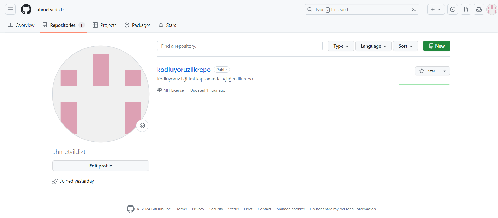

# Kodluyoruzilkrepo
Kodluyoruz Eğitimi kapsamında açtığım ilk repo



## Installation
Öncelikle projeyi clonelayın.
```

git clone https://github.com/ahmetyildiztr/kodluyoruzilkrepo.git

```

## Usage
Projeyi klonladıktan sonra Visual Studio Code programında açınız

## Contributing
Pull requestler kabul edilir.Büyük değişiklikler için, lütfen önce neyi değiştirmek istediğinizi tartışmak için bir konu açınız.

## Lıcense
[MIT](https://choosealicense.com/licenses/mit/)